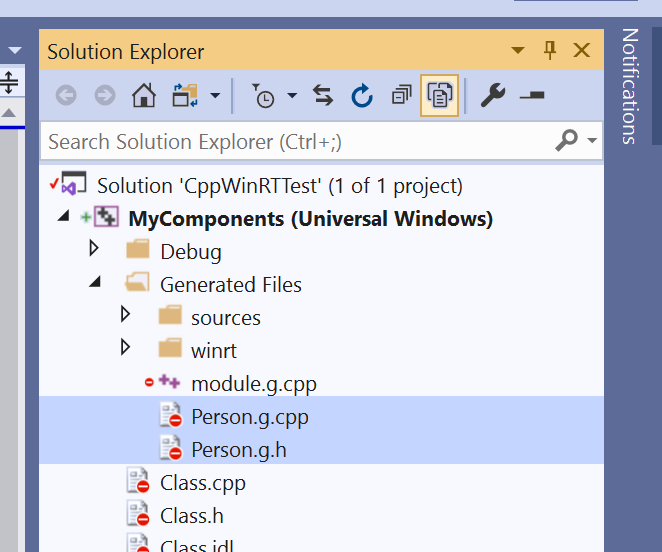
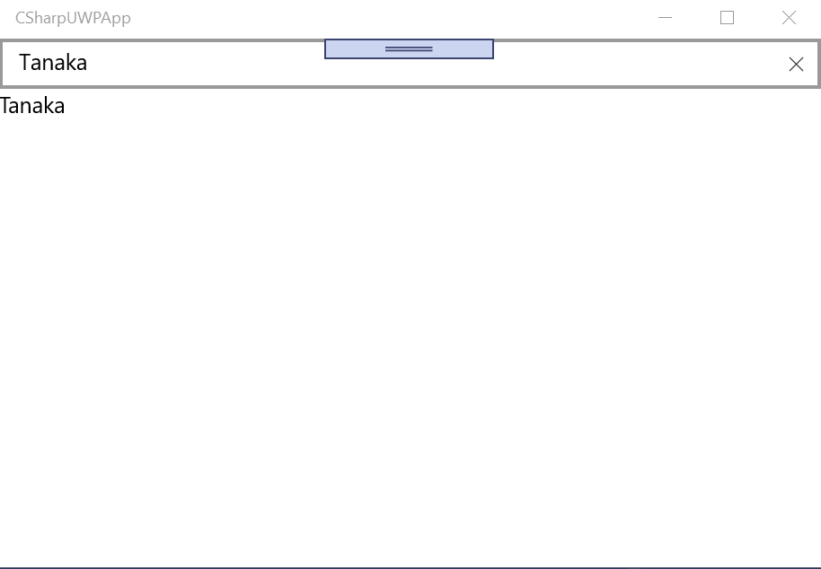

# How to create Windows Runtime Component by C++/WinRT

In this repository, I write how to create Windows Runtime Component by C++/WinRT I learned.

About C++/WinRT is a following:

[C++/WinRT | Micorosft Docs](https://docs.microsoft.com/en-us/windows/uwp/cpp-and-winrt-apis/)

## Step 1: Create a Windows Runtime Component project, and write an idl file

First, create a `Windows Runtime Component (C++/WinRT)` project. I used `MyComponents` as the project name. There is a idl file that name is `Class.idl`, but I remove it because it will not use.

Then, create `Person.idl`, `Person.h` and `Person.cpp`. And then, define `Person` class to `Person.idl`:

```cpp
namespace MyComponents
{
    runtimeclass Person : Windows.UI.Xaml.Data.INotifyPropertyChanged
    {
        Person();
        String Name;
    }
}
```

No intelisence feature, it is not a good experience.

An `.idl` file is defined the specification for Windows Runtime Component.

## Step 2: Create a Person class

Write an `idl` file, and build the project, so two files are generaged, thoses name are `Person.g.h` and `Person.g.cpp` under `Generated Files` folder of the project. (Please change settings to show all files.)



There are class definitions that names are `winrt::MyComponents::implementation::Person_base`, its another name's `winrt::MyComponents::implementation::PersonT` and `winrt::MyComponents::factory_implementation::PersonT`. Create a `Person` class inherits thoses `PersonT` classes.

`Person.h` is as below:

```cpp
#pragma once

#include "Person.g.h" // include the generated header file.

namespace winrt::MyComponents::implementation
{
    struct Person : PersonT<Person>
    {
    };
}

namespace winrt::MyComponents::factory_implementation
{
    struct Person : PersonT<Person, implementation::Person>
    {
    };
}
```

There are same name classes, however those are deferent namespaces. Please don't confuse.

## Step 3: Person class implementation

Creating the `Person` class. Implements `Name` property and `INotifyPropertyChanged` defined at `Person.idl`.

Adding thoses definitions to `Person.h`.

```cpp
#pragma once

#include "Person.g.h"

namespace winrt::MyComponents::implementation
{
    struct Person : PersonT<Person>
    {
        Person() = default;
        winrt::hstring Name() const;
        void Name(winrt::hstring const& name);

        winrt::event_token PropertyChanged(winrt::Windows::UI::Xaml::Data::PropertyChangedEventHandler const& handler);
        void PropertyChanged(winrt::event_token const& token);

    private:
        winrt::hstring _name;
        winrt::event<winrt::Windows::UI::Xaml::Data::PropertyChangedEventHandler> _propertyChanged;
    };
}

namespace winrt::MyComponents::factory_implementation
{
    struct Person : PersonT<Person, implementation::Person>
    {
    };
}
```

And adding implementation to `Person.cpp`. 

```cpp
#include "pch.h"
#include "Person.h"
#include "Person.g.cpp" // include the generated cpp file.

namespace winrt::MyComponents::implementation
{
    winrt::hstring Person::Name() const
    {
        return _name;
    }
    void Person::Name(winrt::hstring const& name)
    {
        _name = name;
        _propertyChanged(*this, Windows::UI::Xaml::Data::PropertyChangedEventArgs(L"Name"));
    }
    winrt::event_token Person::PropertyChanged(winrt::Windows::UI::Xaml::Data::PropertyChangedEventHandler const& handler)
    {
        return _propertyChanged.add(handler);
    }
    void Person::PropertyChanged(winrt::event_token const& token)
    {
        _propertyChanged.remove(token);
    }
}
```

## Step 4: Using it from a C# project

Create a UWP app project as `CSharpUWPApp`. Add reference to `MyComponents` project from the C# project. It's same as using C# project.

Define a `Person` property to `MainPage.xaml.cs`:

```cs
using MyComponents;
using Windows.UI.Xaml.Controls;

// The Blank Page item template is documented at https://go.microsoft.com/fwlink/?LinkId=402352&clcid=0x409

namespace CSharpUWPApp
{
    /// <summary>
    /// An empty page that can be used on its own or navigated to within a Frame.
    /// </summary>
    public sealed partial class MainPage : Page
    {
        private Person Person { get; } = new Person { Name = "Tanaka" };
        public MainPage()
        {
            this.InitializeComponent();
        }
    }
}
```

And let's bind it at `MainPage.xaml`.

```xml
<Page
    x:Class="CSharpUWPApp.MainPage"
    xmlns="http://schemas.microsoft.com/winfx/2006/xaml/presentation"
    xmlns:x="http://schemas.microsoft.com/winfx/2006/xaml"
    xmlns:local="using:CSharpUWPApp"
    xmlns:d="http://schemas.microsoft.com/expression/blend/2008"
    xmlns:mc="http://schemas.openxmlformats.org/markup-compatibility/2006"
    mc:Ignorable="d"
    Background="{ThemeResource ApplicationPageBackgroundThemeBrush}">

    <StackPanel>
        <TextBox Text="{x:Bind Person.Name, Mode=TwoWay, UpdateSourceTrigger=PropertyChanged}" />
        <TextBlock Text="{x:Bind Person.Name, Mode=OneWay}" />
    </StackPanel>
</Page>
```

The result is as below:



It works expectly.

## The Japanese article

https://blog.okazuki.jp/entry/2019/09/20/152238
